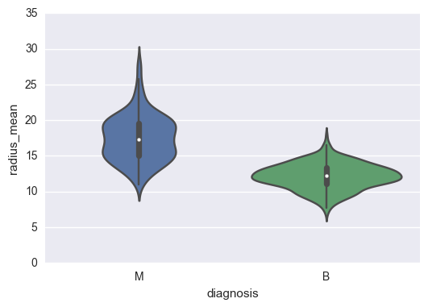
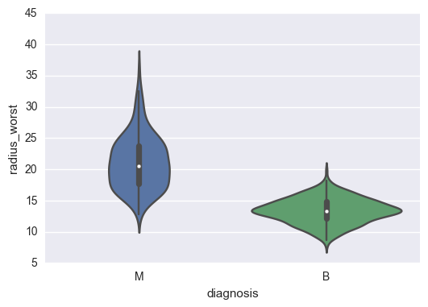
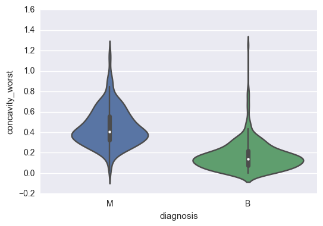
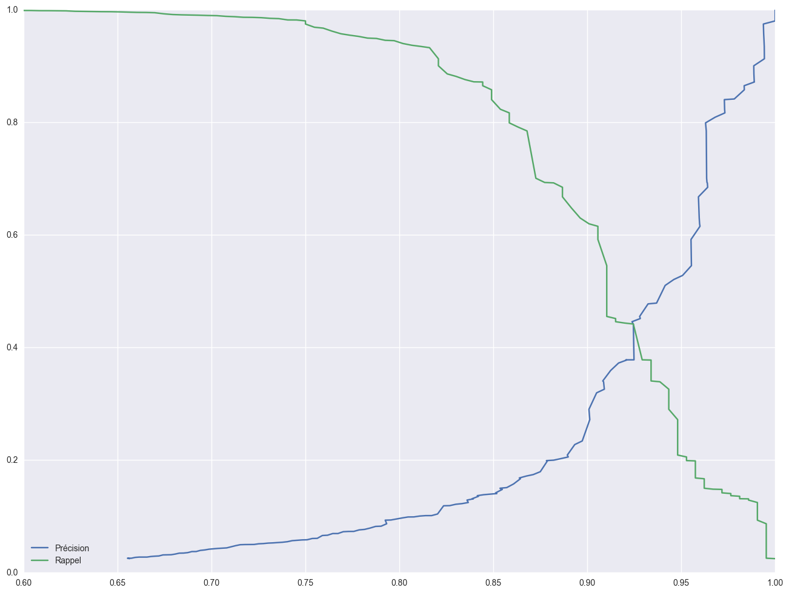

```python
import pandas as pd 
import seaborn as sns
import matplotlib.pyplot as plt
%matplotlib inline
```


```python
data = pd.read_csv("./data.csv")
data.drop('Unnamed: 32', axis=1, inplace=True)
```

# Data Description

Attribute Information:

- ID number 
- Diagnosis (M = malignant, B = benign) 

Ten real-valued features are computed for each cell nucleus: 

a) radius (mean of distances from center to points on the perimeter)   
b) texture (standard deviation of gray-scale values)   
c) perimeter   
d) area   
e) smoothness (local variation in radius lengths)   
f) compactness (perimeter^2 / area - 1.0)   
g) concavity (severity of concave portions of the contour)   
h) concave points (number of concave portions of the contour)   
i) symmetry   
j) fractal dimension ("coastline approximation" - 1)  


```python
data.shape
```


    (569, 32)


Nous avons un échantillons de 569 patientes ayant participées à une étude sur le cancer du sein.


```python
data.diagnosis.value_counts()
```


    B    357
    M    212
    Name: diagnosis, dtype: int64


Sur ces 569 patientes ils y en a 357 avec des tumeurs bénignes et 212 malignes. Nous avons des données sur les noyaux cellulaires des tumeurs extraites lors des annalyses. 


```python
data.columns
```


    Index(['id', 'diagnosis', 'radius_mean', 'texture_mean', 'perimeter_mean',
           'area_mean', 'smoothness_mean', 'compactness_mean', 'concavity_mean',
           'concave points_mean', 'symmetry_mean', 'fractal_dimension_mean',
           'radius_se', 'texture_se', 'perimeter_se', 'area_se', 'smoothness_se',
           'compactness_se', 'concavity_se', 'concave points_se', 'symmetry_se',
           'fractal_dimension_se', 'radius_worst', 'texture_worst',
           'perimeter_worst', 'area_worst', 'smoothness_worst',
           'compactness_worst', 'concavity_worst', 'concave points_worst',
           'symmetry_worst', 'fractal_dimension_worst', 'Unnamed: 32'],
          dtype='object')


```python
sns.violinplot(x="diagnosis", y = "radius_mean", data=data);
```





On voit déja ici très largement que le rayon moyen des cellules extraites sont beaucoup plus importantes pour des tumeurs malignes. Nous pouvons maintenant tester pour les pires cellules plutôt que les valeurs moyennes. 


```python
sns.violinplot(x="diagnosis", y = "radius_worst", data=data);
```





Ces violinplot permettent plus que les boxplot d'obersver la distribution des variables.


```python
sns.violinplot(x="diagnosis", y = "concavity_worst", data=data);
```





On voit que sur tous ces critères on peut arriver à l'oeil à déterminer des règles pour définir si la tumeur est bénigne ou maligne. Nous pouvons essayer de faire un peu de machine learning pour essayer de prédire le type de tumeur en fonction des caractéristiques de ces dernières. 

# Machine Learning 

Ceci est donc un problème de classification, puisqu'il faut  déterminer la classe d'une variable en fonction de données. Pour faire simple nous voulons déterminer si la tumeur est Bénigne (classe B) ou Maligne (classe M) pour cela nous allons utiliser toutes les données mise à notre disposition pour indiquer à la machine comment classifier ces tumeurs. 


```python
from sklearn.linear_model import LogisticRegression
from sklearn.model_selection import train_test_split
```

L'algorithme le plus connu et le plus simple pour des questions de classification est la Régression Logistique. Dans tous problème de machine learning il faut commencer par découper l'ensemble des données en deux parties. L'apprentissage et le jeu de test. Pour cela on peut utiliser le package fournie par scikit. 

La variable indépendante est ici la classe de la tumeur, donc la colonne du diagnostic.


```python
y = data.diagnosis
X = data.drop(["diagnosis", "id"], axis=1)
```


```python
X.dtypes
```


    radius_mean                float64
    texture_mean               float64
    perimeter_mean             float64
    area_mean                  float64
    smoothness_mean            float64
    compactness_mean           float64
    concavity_mean             float64
    concave points_mean        float64
    symmetry_mean              float64
    fractal_dimension_mean     float64
    radius_se                  float64
    texture_se                 float64
    perimeter_se               float64
    area_se                    float64
    smoothness_se              float64
    compactness_se             float64
    concavity_se               float64
    concave points_se          float64
    symmetry_se                float64
    fractal_dimension_se       float64
    radius_worst               float64
    texture_worst              float64
    perimeter_worst            float64
    area_worst                 float64
    smoothness_worst           float64
    compactness_worst          float64
    concavity_worst            float64
    concave points_worst       float64
    symmetry_worst             float64
    fractal_dimension_worst    float64
    dtype: object


Les algorithmes n'utilisent que des valeurs numériques. Dans ce cas, toutes les colonnes (observations) sont déjà bien formatées, si ce n'etait pas le cas il aurait fallu faire un gros travail de nettoyage pour transformer des données sous forme de texte en valeurs numériques. 


```python
X_train, X_test , y_train, y_test = train_test_split(X, y)
model = LogisticRegression(random_state=42, n_jobs=-1)
```

En python il suffit d'instancier le model avec les paramètres que l'on souhaite utiliser. Dans un premier temps, il n'est pas obligatoire de modifier les paramètres. Ici, on fixe juste un etat aléatoire qui permet de renouveller les mêmes experiences plusieurs fois avec les mêmes résultats, le paramètre n_jobs permet de spécifier le nombre de coeurs utilisés pour l'apprentissage du modèle (-1 permet d'utiliser tous les coeurs disponibles).


```python
model.fit(X_train, y_train)
```


    LogisticRegression(C=1.0, class_weight=None, dual=False, fit_intercept=True,
              intercept_scaling=1, max_iter=100, multi_class='ovr', n_jobs=-1,
              penalty='l2', random_state=42, solver='liblinear', tol=0.0001,
              verbose=0, warm_start=False)


On entraine notre modèle avec les données d'apprentissage que nous avons découpé. Et ensuite on prédit sur des données totalement nouvelles pour la machine et on test les performances.


```python
predictions = model.predict(X_test)
predictions
```


    array(['B', 'B', 'M', 'B', 'B', 'B', 'M', 'B', 'B', 'B', 'B', 'B', 'B',
           'B', 'M', 'B', 'B', 'M', 'B', 'B', 'M', 'B', 'M', 'B', 'B', 'B',
           'B', 'B', 'M', 'M', 'B', 'M', 'M', 'M', 'M', 'B', 'B', 'B', 'B',
           'B', 'B', 'B', 'M', 'B', 'B', 'B', 'B', 'M', 'B', 'B', 'B', 'M',
           'M', 'B', 'B', 'B', 'M', 'B', 'M', 'M', 'B', 'B', 'M', 'M', 'B',
           'B', 'M', 'B', 'M', 'M', 'B', 'B', 'M', 'M', 'M', 'M', 'M', 'B',
           'B', 'B', 'B', 'B', 'B', 'M', 'B', 'M', 'M', 'M', 'M', 'B', 'M',
           'B', 'B', 'B', 'B', 'M', 'M', 'M', 'M', 'B', 'M', 'B', 'B', 'B',
           'M', 'B', 'B', 'M', 'B', 'B', 'B', 'B', 'M', 'M', 'B', 'B', 'B',
           'M', 'B', 'B', 'M', 'M', 'B', 'M', 'B', 'B', 'B', 'M', 'B', 'B',
           'B', 'M', 'B', 'B', 'B', 'B', 'B', 'B', 'B', 'M', 'B', 'B', 'B'], dtype=object)


```python
list(zip(predictions, y_test))[0:10]
```


    [('B', 'B'),
     ('B', 'B'),
     ('M', 'M'),
     ('B', 'B'),
     ('B', 'B'),
     ('B', 'B'),
     ('M', 'M'),
     ('B', 'B'),
     ('B', 'B'),
     ('B', 'B')]


On voit très bien que sur les 10 premiers l'algorithme ne s'est pas trompé une seule fois. On peut tester maintenant sur toutes les prédictions combien de fois il s'est trompé.


```python
from collections import Counter
Counter(list(map(lambda x : x[0]==x[1],list(zip(predictions, y_test)) )))
```


    Counter({False: 8, True: 135})


Sur 143 patientes l'algorithmes se serait trompé uniquement 8 fois. On peut maintenant s'intéressé aux types d'erreurs. Si la machine prédit une tumeur maligne à la place d'une tumeur bénigne cela peut être moins grave, puisque le medecin demande des annalyses complémentaires. Dans l'autre cas c'est beaucoup plus embêttant. La patiente rentre chez elle alors qu'elle est gravement malade. 


```python
[elt for e,elt in enumerate(list(zip(predictions, y_test))) if not list(map(lambda x : x[0]==x[1],list(zip(predictions, y_test)) ))[e] ]
```


    [('M', 'B'),
     ('B', 'M'),
     ('B', 'M'),
     ('B', 'M'),
     ('M', 'B'),
     ('B', 'M'),
     ('B', 'M'),
     ('B', 'M')]


Dans deux cas seulement l'agorithme se trompe dans le "bon sens". Dans la plupart des cas c'est le contraire, ce qui est ennuyeux. Nous allons essayer de mettre en place un algorithme plus puissant pour réduire le facteur d'erreur.

## Random Forest 

Pour essayer d'augmenter les performances on peut utiliser des algorithmes plus performant mais aussi jouer sur le seuil de classification. En effet, par défaut c'est au seuil de 0,5 que les classes sont prédite comme 0 ou 1. Si la probabilité est en dessous la classe 0 est prédite si la probabilité est au dessus c'est 1.  

Une bonne pratique est aussi de faire plusieurs ensemble d'apprentissage et plusieurs ensemble de test. C'est appelé de la validation croisées. Elle permet d'apprendre sur des morceaux de l'ensemble et de faire tourner chaque ensemble d'apprentissage et ensemble de test sur l'ensemble de la base. Nous pouvons, comme cela vérifier les performances du modèle sur l'ensemble de la base et non sur les mêmes échantillons. Cela est appelé KFold, dans les exercices de classification il est judicieux d'utiliser la StratifiedKFold qui permet de garder le même nombre de chaque classe dans les différents échantillions.


```python
from sklearn.ensemble import RandomForestClassifier
from sklearn.model_selection import StratifiedKFold
```


```python
stfk = StratifiedKFold(n_splits=4)

predictions = []
predictions_proba = []
y_trues = []
for train_index, test_index in stfk.split(X, y):
    X_train, X_test = X.iloc[train_index], X.iloc[test_index]
    y_train, y_test = y[train_index], y[test_index]
    model = LogisticRegression(300, n_jobs=-1)
    model = LogisticRegression(n_jobs=-1)

    model.fit(X_train, y_train)
    predictions.extend(model.predict(X_test))
    predictions_proba.extend(model.predict_proba(X_test))
    y_trues.extend(y_test)
```

Pour afficher les résultats d'une classification, il est intéressant de regarder la matrice de confusion mais aussi le rapport de classficiation. Ils permettent d'avoir un bon apperçu des résultats très facilement.


```python
from sklearn.metrics import confusion_matrix, classification_report
```


```python
print(model.classes_)
confusion_matrix(predictions, y_trues)
```

    ['B' 'M']
    


    array([[345,  19],
           [ 12, 193]])


On voit avec la matrice de confusion, que 22 échantillions ont été mal prédits. 12 tumeurs ont été prédit comme malignes alors qu'elles étaient bénignes et inversement 10 ont été prédites bénignes alors qu'elles étaient malignes. 


```python
print(classification_report(predictions, y_trues))
```

                 precision    recall  f1-score   support
    
              B       0.97      0.95      0.96       364
              M       0.91      0.94      0.93       205
    
    avg / total       0.95      0.95      0.95       569
    
    

La précision d'un modèle ou plutôt d'une classe est la part d'échantillion prédit comme étant cette classe qui le sont réellement. Le rappel (recall) est la part d'échantillion prédit comme étant de cette classe sur toute la base. La précision comme sont nom l'indique est la prédicision du modèle sur une classe (Est ce que l'échantillion prédit est réellement de cette class ?), le rappel quant à lui permet de déterminer la bonne détection (Est ce que tous les échantillons de cette classe sont bien détectés ? ) C'est un facteur de détection. On peut jouer sur ces deux facteurs en fonction des attentes du modèle. Ici on aimerait avoir un rappel très important pour la class Maligne. C'est a dire détecter toutes les tumeurs malignes. 


```python
thresh = 0.3
print(confusion_matrix(["B" if elt[0] > thresh else "M" for elt in predictions_proba], y_trues))
print(classification_report(["B" if elt[0] > thresh else "M" for elt in predictions_proba], y_trues))
```

    [[350  27]
     [  7 185]]
                 precision    recall  f1-score   support
    
              B       0.98      0.93      0.95       377
              M       0.87      0.96      0.92       192
    
    avg / total       0.94      0.94      0.94       569
    
    

Evidémment la précision est fortement corrélée au rappel. Plus on est stricte sur les critères plus la précision sera bonne mais on passera à coté de plusieurs éléments. ICi on voit que seulement 7 tumeurs ont été prédites comme bénignes alors qu'elles étaient malignes.

On peut tracer les courbes de précision et rappel pour mieux comprendre la notion de seuil.


```python
from sklearn.metrics import precision_recall_curve
```


```python
predictions_proba
```


    ---------------------------------------------------------------------------

    TypeError                                 Traceback (most recent call last)

    <ipython-input-83-1d357bd4a373> in <module>()
    ----> 1 predictions_proba[:,0]
    

    TypeError: list indices must be integers or slices, not tuple


```python
import numpy as np
```


```python
len(np.append(thres1, 1))
```


    411


```python
len(pres1), len(np.asarray(thres1))
```


    (411, 410)


### Précision Rappel pour la classe Bénigne 


```python
fig, ax  = plt.subplots()
fig.set_size_inches(16, 12)
pres1, rec1, thres1 = precision_recall_curve(y_trues, [elt[0] for elt in predictions_proba], pos_label="B")
ax.plot(pres1, np.append(thres1, 1), label="Précision");
ax.plot(rec1, np.append(thres1, 1), label="Rappel");
ax.set_xlim(0.8, 1)
ax.legend(loc=0)
```


    <matplotlib.legend.Legend at 0x16df4948240>


### Précision Rappel pour la classe Maligne


```python
fig, ax  = plt.subplots()
fig.set_size_inches(16, 12)
pres2, rec2, thres2 = precision_recall_curve(y_trues, [elt[1] for elt in predictions_proba], pos_label="M")
ax.plot(pres2, np.append(thres2, 1), label="Précision");
ax.plot(rec2, np.append(thres2, 1), label="Rappel");
ax.set_xlim(0.6, 1)
ax.legend(loc=0)
```


    <matplotlib.legend.Legend at 0x16df4b1e8d0>




