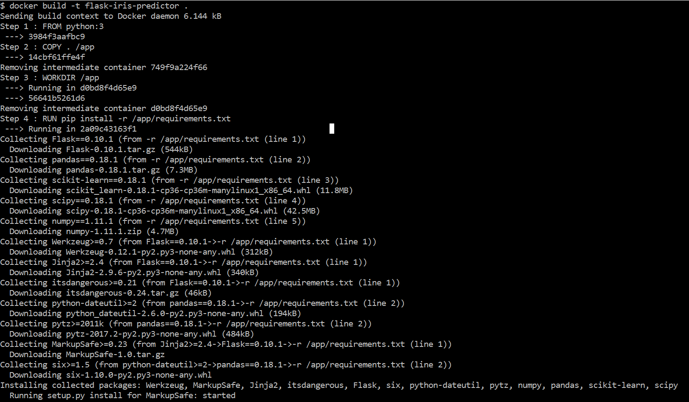
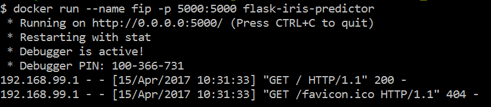
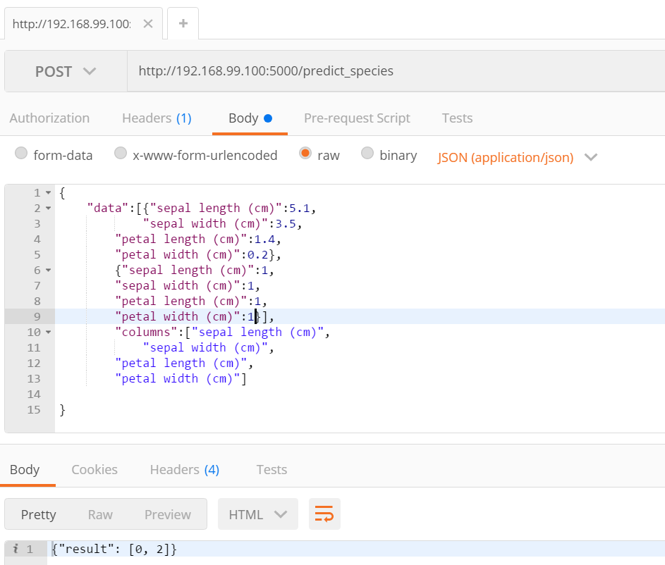

# Introduction a Docker

Pour commencer Docker est un sytème de virtualisation un peu comme les Virtual Machines qui utilise des conteneur. Chaque conteneur est complètement indépendant et possède sa propre architecture, arborescences, etc...

La différence majeure et celle qui fait que Docker est de plus en plus utilisé aujourd'hui est qu'il permet de partager entre ses conteneurs un unique noyaux et donc d'uniques dépendances. Cela permet une grande vitesse de mise en place de conteneur de mêmes types.

Docker permet de virtualiser des clusters Cassandra ou Elastic Search, des bases MongoDB ou MySQL, des serveur Apache et ce qui va nous intéresser ce sont des applications Python.

# Docker et Flask

Pour des soucis de mise en production on peut vouloir intégrer l'API Flask mise en place dans l'article précédent dans un conteneur Docker. Pour cela il faut récupérer les fichiers api.py et le modèle créé.


```python
mkdir docker_build
```


```python
!mv api.py docker_build/
```


```python
!mv logisticregression.pkl docker_build/
```


```python
cd docker_build/
```

    C:\Users\rcour\work\Blog Articles\FlaskDocker\docker_build


Il faut maintenant créer un fichier de dépendances ```requirements.txt``` pour les installer via pip.

```
Flask==0.10.1
pandas==0.18.1
scikit-learn==0.18.1
scipy==0.18.1
numpy==1.11.1
```

## DockerFile

Et un Dockerfile...  
Le dockerfile permet d'indiquer les étapes de la constitution de l'image docker et donc de l'instanciation d'un conteneur.

```
FROM python:3

COPY . /app

WORKDIR /app

RUN pip install -r /app/requirements.txt

ENTRYPOINT ["python"]

CMD ["api.py"]
```

Revenons sur chaque ligne une par une :

`FROM ..`

permet d'indiquer l'image de base utilisé par l'image que nous sommes en train de mettre en place. Ici notre image part d'une distribution Python3 de base. Mais il peut être remplacé par une image Ubuntu, Apache, PHP , Cassandra, etc.

`COPY .. `

comme son nom l'indique permet de copier les fichiers local dans le conteneur.

`WORKDIR .. `

précise le dossier principal du conteneur.

`RUN .. `

exécute une commande bash. Dans notre cas on veut que sur la distribution python soient installées toutes les dépendances nécessaires pour le bon fonctionnement de l'application.

`ENTRYPOINT ..`  

permet de définir un conteneur comme un exécutable. Ici notre application utilisera python.

`CMD .. `  

est la commande appelé à l'instantiation du conteneur. Ici comme nous avons définit un ENTRYPOINT python. La commande appelé sera python api.py. Qui permet de lancer API Flask.
Nous arions très bien pu ne pas définir d'ENTRYPOINT mais une commande CMD ["python" , "api.py"]


## Build l'image docker

Il faut maintenant lancer la build de l'image docker qui permettra d'instancier le conteneur. Pour cela il faut lancer la commande suivante dans le dossier du DockerFile sans oublier le point.


```python
!docker build --no-cache -t flask-iris-predictor .
```

Cela peut prendre un peu de temps puisqu'il doit télécharger toutes les librairies défini par le FROM donc toutes les dépendances de python3 et toutes celles que nous avons rajouté avec le fichier requirements.txt. Lorsque cela sera fait les instanciations des conteneurs se fera presque instantanément.




Pour instancier le conteneur il ne suffit plus que de faire un docker run


```python
!docker run --name iris-predictor -p 5000:5000 flask-iris-predictor
```



Les conteneurs sont instanciés sur une docker machine qui possède sa propre IP. Pour la trouver il faut utiliser la commande :  `docker-machine ip `. LA plupart du temps c'est l'adresse 192.168.99.100. Pour accéder à l'API il faut donc utiliser http://192.168.99.100:5000/

## Tests

Pour tester on peut utiliser PostMan qui permet de faire des requêtes HTTP très facilement. On utilise la route de l'API permettant de prédire le type de fleur et on lui fourni un JSON comportant les données que l'on veut tester.


Voila l'API REST est prête à être utilisée depuis une architecture Docker.
