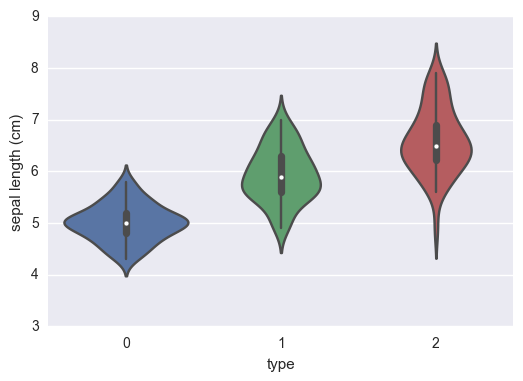
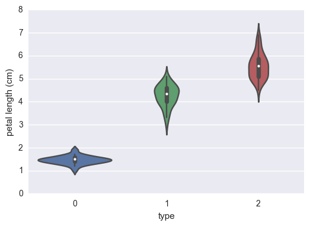
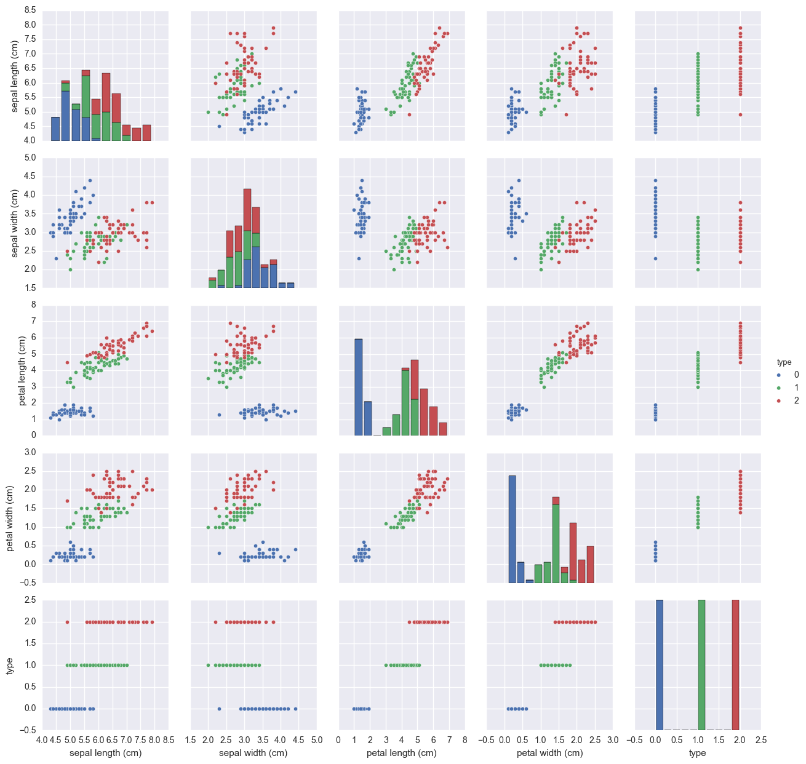

```python
import pandas as pd 
from sklearn.datasets import load_iris
import seaborn as sns
%matplotlib inline
```

Le but de cet article est de montrer comment on peut mettre en place une API REST permettant de mettre en production un modèle assez facielemnt avec Python. 

Pour cela nous allons mettre en place une classification très facile avec un jeu de données utilisé par tous les jeunes Data-Scientists permettant de comprendre les bases de l'analyse de données. Ce jeu de données est constitué des 150 échantillons de fleurs. On possède les caractéristiques physiques de ces fleurs et le but du jeu est de trouver le type de fleur en fonction de ces derniers.

# Chargement des données et rapides annalyses 


```python
iris = load_iris()
X = iris.data
Y = iris.target
```


```python
X.shape, iris.feature_names
```


    ((150, 4),
     ['sepal length (cm)',
      'sepal width (cm)',
      'petal length (cm)',
      'petal width (cm)'])


```python
df_iris = pd.DataFrame(X, columns=iris.feature_names)
df_iris["type"] = Y
```


```python
sns.violinplot(x="type", y= 'sepal length (cm)', data = df_iris);
```





```python
sns.violinplot(x="type", y= 'petal length (cm)', data = df_iris);
```





On peut déja voir dans un premier temps que ces simples indicateurs permettent, à l'oeil nu de distinguer les différentes espèces.


```python
sns.pairplot(df_iris, hue="type")
```


    <seaborn.axisgrid.PairGrid at 0x1f33d5fd668>





Ces graphs permettent de très bien faire la différences entre les différentes espèces de plantes.

# Modèle 

Pour notre example nous allons utiliser uniquement une Regression Logistique pour avoir de bonnes performances dans des temps très corrects.


```python
from sklearn.linear_model import LogisticRegression
from sklearn.model_selection import train_test_split
```


```python
X_train, X_test, y_train, y_test = train_test_split(df_iris.drop("type", axis=1),Y)
```


```python
lr_model = LogisticRegression()
lr_model.fit(X_train, y_train)
```


    LogisticRegression(C=1.0, class_weight=None, dual=False, fit_intercept=True,
              intercept_scaling=1, max_iter=100, multi_class='ovr', n_jobs=1,
              penalty='l2', random_state=None, solver='liblinear', tol=0.0001,
              verbose=0, warm_start=False)


```python
lr_model.predict(X_test)
```


    array([1, 1, 0, 2, 1, 1, 1, 2, 2, 2, 2, 2, 2, 1, 2, 2, 2, 2, 0, 2, 2, 0, 0,
           2, 1, 0, 0, 1, 2, 1, 0, 0, 0, 2, 2, 1, 2, 0])


Même si dans ce cas l'apprentissage du modèle est très rapide il vaut mieux stocker (dumper) en mémoire notre modèle afin d'uniquement le recharger lorsque l'on en a besoin. Pour cela, sklearn mets en place un module joblib qui permet de remplir exactement ce rôle.


```python
from sklearn.externals import joblib
```


```python
joblib.dump(lr_model, "./logisticregression.pkl")
```


    ['./logisticregression.pkl']


Pour le recharger il suffit de faire un load de la même manière ...


```python
lr_model = joblib.load("./logisticregression.pkl")
```

# API Flask

Pour utiliser ce modèle prédictif il faut pouvoir y accéder de n'importe ou et depuis n'importe quelle plateforme. Pour cela le plus facile est d'utiliser une API REST. Il existe plusieurs libraries Python permettant de créer assez facilement une API (Bottle, Django et Flask par exemple). Django étant beaucoup plus difficile à mettre en place c'est une grosse usine à gaz. Les deux autres sont très facile à prendre en mains. Dans notre cas nous allons utiliser Flask. Il suffit de déclarer une app de définir les routes et les fonctions correspondantes et le tour est joué. 

Si vous n'avez jamais touché à une API REST de quelque sorte, les route sont des points de l'url. Ils permettent de structurer une api et d'accéder à des fonctions bien précises. Nous avons donc fait un point d'API `predict_species` qui permet de récupérer les données et de prédire les espèces de plantes. 

Les bonnes pratiques sont d'utiliser un POST récupérant des arguments au format JSON. Ces données sont utilisés par le modèle et renvoyées en tant que résultats avec les prédictions du modèle.


```python
from flask import Flask, request
import pandas as pd
from sklearn.externals import joblib

```

Pour créer une API Flask il suffit d'instancier un objet Flask qui sera notre application


```python
app = Flask(__name__)
```

Ensuite, comme nous l'avons vu précédemment nous devons définir les routes de l'API pour pouvoir accéder aux différentes fonctions. Une routes à la racine qui permet de vérifier si l'API est en fonction...


```python
@app.route('/')
def home():
    return 'Iris species predictor API !'

```

Et une route permettant d'accéder à notre modèle...


```python
@app.route('/predict_species' , methods=['POST'])
def predict_species():
    if request.method == 'POST':
        dataframe = pd.DataFrame(request.get_json()["data"])
        model = joblib.load("./logisticregression.pkl")
        return json.dumps({"result":[int(elt) for elt in list(model.predict(dataframe))]})
```

Nous créons pour cette route une fonction spécifique qui se chargera d'appeler le modèle et de renvoyer les résultats. Finalement il suffit d'appeler la méthode ```.run()``` sur notre application


```python
if __name__ =="__main__":
    app.run()
```

     * Running on http://127.0.0.1:5000/ (Press CTRL+C to quit)
    

Pour pouvoir renvoyer les résultats via l'API, on doit créer un dictionnaire de la forme d'un JSON. Il faut que les résultats soient serializables (peuvent être transformés en string). Dans notre cas, les numpy array et les int64 de numpy (renvoyés par le modèle) ne le sont pas. C'est pour cela qu'il faut les convertir en objets de base python pour pouvoir les transportés. 


```python
import json, requests
```


```python
headers = {'Content-Type' : 'application/json'}
```

Il nous suffit alors d'envoyer un POST sur le point d'API créé, avec les données de test en data. Cela nous renvoit les données prédites. Ce POST peut être effectué directement depuis Python mais aussi depuis PostMan ou n'importe qu'elle autre plateforme de programmation avec un accès http très simple. 


```python
response = requests.post("http://localhost:5000/predict_species", 
                         headers=headers, 
                         data=json.dumps({"data":[{iris.feature_names[i]:d for i,d in enumerate(elt)} for elt in X_test.as_matrix()], 
                                         "columns":list(X_test.columns)}))
```


```python
response
```


    <Response [200]>


Le code 200 est le code valide d'une requête http.


```python
response.text
```


    '{"result": [1, 1, 0, 2, 1, 1, 1, 2, 2, 2, 2, 2, 2, 1, 2, 2, 2, 2, 0, 2, 2, 0, 0, 2, 1, 0, 0, 1, 2, 1, 0, 0, 0, 2, 2, 1, 2, 0]}'


```python
y_test
```


    array([1, 1, 0, 2, 1, 1, 1, 1, 2, 1, 2, 2, 2, 1, 2, 2, 2, 2, 0, 1, 1, 0, 0,
           2, 2, 0, 0, 1, 2, 2, 0, 0, 0, 2, 2, 1, 2, 0])


```python
from sklearn.metrics import confusion_matrix, classification_report
```


```python
confusion_matrix(y_test, response.json()["result"])
```


    array([[10,  0,  0],
           [ 0,  8,  4],
           [ 0,  2, 14]])


```python
print(classification_report(y_test, response.json()["result"]))
```

                 precision    recall  f1-score   support
    
              0       1.00      1.00      1.00        10
              1       0.80      0.67      0.73        12
              2       0.78      0.88      0.82        16
    
    avg / total       0.84      0.84      0.84        38
    
    
