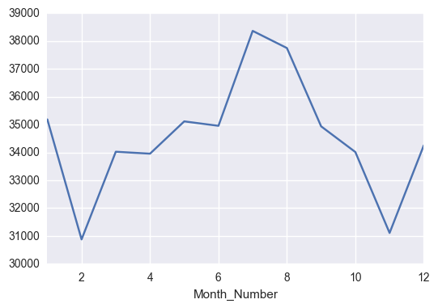

```python
import pandas as pd
import numpy as np
import matplotlib.pyplot as plt

import seaborn as sns
import matplotlib
%matplotlib inline
```


```python
data = pd.read_csv("./database.csv")
```

    C:\Users\rcour\Anaconda3\lib\site-packages\IPython\core\interactiveshell.py:2717: DtypeWarning: Columns (16) have mixed types. Specify dtype option on import or set low_memory=False.
      interactivity=interactivity, compiler=compiler, result=result)
    


```python
data = data[((data["Victim Age"]>0) & (data["Victim Age"]<100))]
data = data[((data["Perpetrator Age"]>0) & (data["Perpetrator Age"]<100))]
```

# Clean Data 


```python
import calendar 
dict_matching = {v: k for k,v in enumerate(calendar.month_name)}
data["Month_Number"] = data["Month"].apply(lambda x : dict_matching[x])
data["Month_Number"].head()
```


    0    1
    1    3
    3    4
    5    5
    6    5
    Name: Month_Number, dtype: int64


```python
data.groupby(["Year", "Month_Number"]).count()["Record ID"].plot();
```


```python
data.groupby("Year").count()["Record ID"].plot();
```


On peut voir un gros pique de crimes dans les années 90 et une forte baisse jusqu'à aujourd'hui. On peut maintenant regarder par mois. 


```python
data.groupby("Month_Number").count()["Record ID"].plot();
```





Il faut faire très attention à l'échelle d'un graph (surtout si on ne met pas en évidence les valeurs des axes),  ici cela laisserai penser qu'en février il y vraiment très peu de crimes et deux fois plus en mars quen juillet par exemple. 


```python
data.groupby("Month_Number").count()["Record ID"].plot(kind="bar");
```


On voit que la fluctuation est plutôt faible mais il reste vrai que l'été est la saison la plus dangereuse aux Etats Unis.  

On voit apparaître de nombreuses incohérences dans les données que ce soit dans les types ou les données elles mêmes. 


```python
clean_int = lambda x : int(x) if x != " " else np.NaN
#data["Perpetrator Age"]= data["Perpetrator Age"].apply(clean_int)
data["Perpetrator Age"].value_counts().head()
```


    20.0    21078
    19.0    19711
    18.0    18458
    21.0    18384
    22.0    17896
    Name: Perpetrator Age, dtype: int64


On voit d'ailleurs que la plupart  des ages précisés sont de 0 an. Une grosses vague de meurtrier sortis de la maternité ;). On reture bien évidemment les données nulles. 


```python
data["Perpetrator Age"][data["Perpetrator Age"]>0].hist(bins=100)
```


    <matplotlib.axes._subplots.AxesSubplot at 0x276a6441f60>


Si on s'intéresse maintenant à l'âge des victimes. 


```python
data["Victim Age"][((data["Victim Age"]>0)&(data["Victim Age"]<99))].hist(bins=100)
```


    <matplotlib.axes._subplots.AxesSubplot at 0x276a64b7630>


Les distributions sont assez équivalentes. On voit que la plupart des victimes se situent dans la trentaine d'années. On voit aussi que les periodes les plus sures pour les américains sont à 10 ans et après 60 ans. 


```python
data["Victim Sex"].value_counts().plot(kind="bar")
```


    <matplotlib.axes._subplots.AxesSubplot at 0x276a66827f0>


On voit déjà que il ya trois fois plus de victimes du sexe masculin que du sexe féminin. Ensuite on peut observer les distributions de l'age des victimes en fonction du type de crime. 


```python
sns.violinplot(x="Crime Type", y = "Victim Age", hue="Victim Sex", data=data[data["Victim Sex"]!= "Unknown"], split=True)
```


    <matplotlib.axes._subplots.AxesSubplot at 0x276a0c44898>


On voit, comme précédement que la plupart des meurtres sont sur des personnes entre 20 et 30 ans un peu moins chez les homes. Les femmes jeunes sont plus touché par des meurtres à proprement parlé que les hommes. La distributions de l'age des femmes est plus centré sur la vingtaine d'années. 


```python
sns.violinplot(x="Crime Solved", y = "Victim Age", hue="Victim Sex", data=data[data["Victim Sex"]!= "Unknown"], split=True)
```


    <matplotlib.axes._subplots.AxesSubplot at 0x276a6382f60>


Quels sont les types de victimes préférés en fonctions des sexes des meurtriers ?


```python
data[((data["Perpetrator Sex"] != "Unknown") & (data["Victim Sex"] != "Unknown"))].groupby(["Perpetrator Sex", "Victim Sex"]).count()["Record ID"].plot(kind="bar")
```


    <matplotlib.axes._subplots.AxesSubplot at 0x276a7643c88>


Les crimes pationnels de femmes entre elles ne sont alors que des mythes des series américaines.


```python
data["Weapon"]
```


```python

```


```python
sns.violinplot(x="Weapon", y = "Perpetrator Age", hue="Perpetrator Sex", 
               split=True, data=data[data['Perpetrator Sex']!="Unknown"],
              size=10, aspect=10, )
```


    <matplotlib.axes._subplots.AxesSubplot at 0x276b7666ac8>


