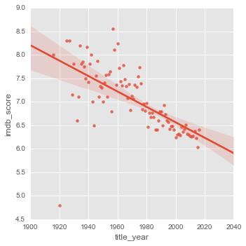

```python
import pandas as pd
import matplotlib
import matplotlib.pyplot as plt
import seaborn as sns
import math
matplotlib.style.use("ggplot")
%matplotlib inline
plt.rcParams['figure.figsize']=(16,10)
```

Pour cette étude j'ai utilisé les données provenant de la plateforme de notation IMDB qui regroupe une large communauté notant les films et les séries


```python
movies = pd.read_csv("./data/movie_metadata.csv")
movies.head()
```


<div>
<table border="1" class="dataframe">
  <thead>
    <tr style="text-align: right;">
      <th></th>
      <th>color</th>
      <th>director_name</th>
      <th>num_critic_for_reviews</th>
      <th>duration</th>
      <th>director_facebook_likes</th>
      <th>actor_3_facebook_likes</th>
      <th>actor_2_name</th>
      <th>actor_1_facebook_likes</th>
      <th>gross</th>
      <th>genres</th>
      <th>...</th>
      <th>num_user_for_reviews</th>
      <th>language</th>
      <th>country</th>
      <th>content_rating</th>
      <th>budget</th>
      <th>title_year</th>
      <th>actor_2_facebook_likes</th>
      <th>imdb_score</th>
      <th>aspect_ratio</th>
      <th>movie_facebook_likes</th>
    </tr>
  </thead>
  <tbody>
    <tr>
      <th>0</th>
      <td>Color</td>
      <td>James Cameron</td>
      <td>723.0</td>
      <td>178.0</td>
      <td>0.0</td>
      <td>855.0</td>
      <td>Joel David Moore</td>
      <td>1000.0</td>
      <td>760505847.0</td>
      <td>Action|Adventure|Fantasy|Sci-Fi</td>
      <td>...</td>
      <td>3054.0</td>
      <td>English</td>
      <td>USA</td>
      <td>PG-13</td>
      <td>237000000.0</td>
      <td>2009.0</td>
      <td>936.0</td>
      <td>7.9</td>
      <td>1.78</td>
      <td>33000</td>
    </tr>
    <tr>
      <th>1</th>
      <td>Color</td>
      <td>Gore Verbinski</td>
      <td>302.0</td>
      <td>169.0</td>
      <td>563.0</td>
      <td>1000.0</td>
      <td>Orlando Bloom</td>
      <td>40000.0</td>
      <td>309404152.0</td>
      <td>Action|Adventure|Fantasy</td>
      <td>...</td>
      <td>1238.0</td>
      <td>English</td>
      <td>USA</td>
      <td>PG-13</td>
      <td>300000000.0</td>
      <td>2007.0</td>
      <td>5000.0</td>
      <td>7.1</td>
      <td>2.35</td>
      <td>0</td>
    </tr>
    <tr>
      <th>2</th>
      <td>Color</td>
      <td>Sam Mendes</td>
      <td>602.0</td>
      <td>148.0</td>
      <td>0.0</td>
      <td>161.0</td>
      <td>Rory Kinnear</td>
      <td>11000.0</td>
      <td>200074175.0</td>
      <td>Action|Adventure|Thriller</td>
      <td>...</td>
      <td>994.0</td>
      <td>English</td>
      <td>UK</td>
      <td>PG-13</td>
      <td>245000000.0</td>
      <td>2015.0</td>
      <td>393.0</td>
      <td>6.8</td>
      <td>2.35</td>
      <td>85000</td>
    </tr>
    <tr>
      <th>3</th>
      <td>Color</td>
      <td>Christopher Nolan</td>
      <td>813.0</td>
      <td>164.0</td>
      <td>22000.0</td>
      <td>23000.0</td>
      <td>Christian Bale</td>
      <td>27000.0</td>
      <td>448130642.0</td>
      <td>Action|Thriller</td>
      <td>...</td>
      <td>2701.0</td>
      <td>English</td>
      <td>USA</td>
      <td>PG-13</td>
      <td>250000000.0</td>
      <td>2012.0</td>
      <td>23000.0</td>
      <td>8.5</td>
      <td>2.35</td>
      <td>164000</td>
    </tr>
    <tr>
      <th>4</th>
      <td>NaN</td>
      <td>Doug Walker</td>
      <td>NaN</td>
      <td>NaN</td>
      <td>131.0</td>
      <td>NaN</td>
      <td>Rob Walker</td>
      <td>131.0</td>
      <td>NaN</td>
      <td>Documentary</td>
      <td>...</td>
      <td>NaN</td>
      <td>NaN</td>
      <td>NaN</td>
      <td>NaN</td>
      <td>NaN</td>
      <td>NaN</td>
      <td>12.0</td>
      <td>7.1</td>
      <td>NaN</td>
      <td>0</td>
    </tr>
  </tbody>
</table>
<p>5 rows × 28 columns</p>
</div>


Dans un premier temps on peut commencer par faire un rapide descriptif des données fournies


```python
movies.shape, movies.dropna(axis=0).shape
```


    ((5043, 28), (3756, 28))


```python
movies.columns
```


    Index(['color', 'director_name', 'num_critic_for_reviews', 'duration',
           'director_facebook_likes', 'actor_3_facebook_likes', 'actor_2_name',
           'actor_1_facebook_likes', 'gross', 'genres', 'actor_1_name',
           'movie_title', 'num_voted_users', 'cast_total_facebook_likes',
           'actor_3_name', 'facenumber_in_poster', 'plot_keywords',
           'movie_imdb_link', 'num_user_for_reviews', 'language', 'country',
           'content_rating', 'budget', 'title_year', 'actor_2_facebook_likes',
           'imdb_score', 'aspect_ratio', 'movie_facebook_likes'],
          dtype='object')


On ne garde, pour l'instant, que les lignes étant totalement fournies. On verra dans un deuxième temps comment remplir ces données manquantes. 

Faisons quelques graphiques pour représenter ces données qui ne sont pas très parlantes pour l'instant. Pour cela on peut utiliser matplotlib, la librairie de référence pour les graphiques en python, mais j'aime bien utiliser seaborn qui permet très facilement de réaliser des graphiques assez attractifs.

Concentrons nous sur les notes attribuées par la plateforme. 


```python
fig, ax = plt.subplots()
movies.imdb_score.hist(bins=20, ax=ax)
ax.axvline(movies.imdb_score.mean())
```


    <matplotlib.lines.Line2D at 0x18eed4d0550>


```python
movies.imdb_score.mean()
```


    6.442137616498111


On peut se poser la question de quelle serait l'année ayant fournie les meilleurs films. Pour cela on peut afficher la moyenne des notes en fonctions des années de sortie des films.


```python
df_mean_by_year = movies.groupby("title_year", as_index=False).agg("mean")
sns.lmplot(x="title_year", y="imdb_score", data=df_mean_by_year)
```


    <seaborn.axisgrid.FacetGrid at 0x18eed486e10>





On voit très clairement un net dégradations des notes en fonctions des années. 


```python
movies["count"] = 1
movies.groupby("title_year").agg({"count":"count"}).plot()
```


    <matplotlib.axes._subplots.AxesSubplot at 0x18eec199b38>


```python
Mais le nombre de film à lui aussi très largement augmenté. 
```


      File "<ipython-input-40-b9f860e33cf6>", line 1
        Mais le nombre de film à lui aussi très largement augmenté.
              ^
    SyntaxError: invalid syntax
    


```python
df_max_by_year = movies.groupby("title_year", as_index=False).agg("max")
sns.lmplot(x="title_year", y="imdb_score", data=df_mean_by_year)
```


    <seaborn.axisgrid.FacetGrid at 0x18eebf02b70>


Mais les notes maximum attribuées sont légerement en hause. Mais quels sont les films les mieux notés de ces 100 dernières années ?


```python
movies[~movies["director_name"].isnull()].sort_values("imdb_score", ascending=False).head(10)[["director_name", "movie_title", "imdb_score"]]
```


<div>
<table border="1" class="dataframe">
  <thead>
    <tr style="text-align: right;">
      <th></th>
      <th>director_name</th>
      <th>movie_title</th>
      <th>imdb_score</th>
    </tr>
  </thead>
  <tbody>
    <tr>
      <th>2765</th>
      <td>John Blanchard</td>
      <td>Towering Inferno</td>
      <td>9.5</td>
    </tr>
    <tr>
      <th>1937</th>
      <td>Frank Darabont</td>
      <td>The Shawshank Redemption</td>
      <td>9.3</td>
    </tr>
    <tr>
      <th>3466</th>
      <td>Francis Ford Coppola</td>
      <td>The Godfather</td>
      <td>9.2</td>
    </tr>
    <tr>
      <th>4409</th>
      <td>John Stockwell</td>
      <td>Kickboxer: Vengeance</td>
      <td>9.1</td>
    </tr>
    <tr>
      <th>2837</th>
      <td>Francis Ford Coppola</td>
      <td>The Godfather: Part II</td>
      <td>9.0</td>
    </tr>
    <tr>
      <th>66</th>
      <td>Christopher Nolan</td>
      <td>The Dark Knight</td>
      <td>9.0</td>
    </tr>
    <tr>
      <th>4498</th>
      <td>Sergio Leone</td>
      <td>The Good, the Bad and the Ugly</td>
      <td>8.9</td>
    </tr>
    <tr>
      <th>3355</th>
      <td>Quentin Tarantino</td>
      <td>Pulp Fiction</td>
      <td>8.9</td>
    </tr>
    <tr>
      <th>1874</th>
      <td>Steven Spielberg</td>
      <td>Schindler's List</td>
      <td>8.9</td>
    </tr>
    <tr>
      <th>4822</th>
      <td>Sidney Lumet</td>
      <td>12 Angry Men</td>
      <td>8.9</td>
    </tr>
  </tbody>
</table>
</div>


# Quels genres préfèrent t'on ?


```python
ax = sns.violinplot(x="genres", y="imdb_score",
        data=movies, palette="Set2", split=True,order= list(movies.genres.value_counts().head(10).index),
        scale="area", inner="quartile")
```


```python
movies.groupby("genres").agg({"imdb_score":"mean","count":"count"}).sort_values("imdb_score", ascending=False).head(5)
```


<div>
<table border="1" class="dataframe">
  <thead>
    <tr style="text-align: right;">
      <th></th>
      <th>imdb_score</th>
      <th>count</th>
    </tr>
    <tr>
      <th>genres</th>
      <th></th>
      <th></th>
    </tr>
  </thead>
  <tbody>
    <tr>
      <th>Action|Adventure|Crime|Drama|Sci-Fi|Thriller</th>
      <td>8.8</td>
      <td>1</td>
    </tr>
    <tr>
      <th>Action|Adventure|Biography|Drama|History</th>
      <td>8.6</td>
      <td>1</td>
    </tr>
    <tr>
      <th>Crime|Drama|Fantasy|Mystery</th>
      <td>8.5</td>
      <td>1</td>
    </tr>
    <tr>
      <th>Adventure|Animation|Drama|Family|Musical</th>
      <td>8.5</td>
      <td>1</td>
    </tr>
    <tr>
      <th>Action|Drama|History|Thriller|War</th>
      <td>8.5</td>
      <td>1</td>
    </tr>
  </tbody>
</table>
</div>


# Comment prédire le score IMDB

On voit assez bien que les notes sont plutot au dessus de la moyenne. On peut maintenant essayer de voir si on peut trouver une corrélation entre le nombre de like de chaque acteur et la note attribuée.


```python
sns.jointplot(x="cast_total_facebook_likes", y="imdb_score", data=movies);
```


On voit ici que les données sont très écrasées autours de 0. On voit quelques points qu'on  peut nommés d'outliers ce qui veut dire qu'ils sont vraiment éloignés de la plupart des autres points de l'échantillions.  
Pour cela nous avons plusieurs solutions, les plus faciles à mettre en oeuvre sont de les enlever tout simplement ou d'appliquer un logarithme sur la variable en question. On sait par contre que le log n'est défini que sur ]0;+inf[ il faut prendre en compte cela dans sa mise en place.


```python
movies["cast_total_facebook_likes_log"] = movies["cast_total_facebook_likes"].apply(lambda x : math.log(x) if x!=0 else x)
```

Si on réaplique le log sur cette nouvelle variable créée


```python
sns.jointplot(x="cast_total_facebook_likes_log", y="imdb_score", data=movies);

```


On voit que le nuage de point, ainsi que l'histograme ne sont plus écrasés en 0 mais nous ne pouvons malheuresement pas tiré de conclusions sur la création du score en fonction du nombre de likes de l'équipe du tournage.
