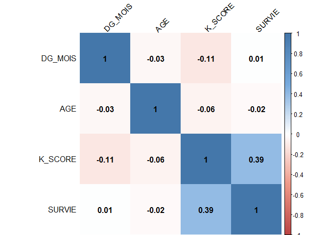

Cancer du Poumon
================

GitHub Documents
----------------

This is an R Markdown format used for publishing markdown documents to GitHub. When you click the **Knit** button all R code chunks are run and a markdown file (.md) suitable for publishing to GitHub is generated.

Including Code
--------------

You can include R code in the document as follows:

``` r
library(FactoMineR)
library(corrplot)
library(ggplot2)
directory.down<- '//'
file<-'PB_I_ACP.txt'  

source("ACP_TOOLS.R")  
```

Formatage de la dataframe
-------------------------

``` r
df<-read.table(file,header = TRUE)
df <- df[-c(106, 70,75, 118, 12, 95),]
```

Statistiques générales
----------------------

``` r
va.num<-which(sapply(df,is.numeric))
va.cat<-which(sapply(df,is.factor))

#-> Box plot full model
df.num<- df[,va.num] ;
df.cat<- df[,va.cat] ;
nb.ind <- dim(df.num)[1]


# box plot des variables numériques
df.num.scale <-apply(df.num,2,scale) 
PROC_BOXPLOTALL(df.num.scale, p = c(1,1), main.name = 'donnees standardisees')
```

Statistiques univariées
-----------------------

``` r
stat.sum <-apply(df.num,2,summary) ; 
stat.sd  <-apply(df.num,2,sd) 
pca.stat <-rbind(stat.sum,stat.sd)
```

Statistiques categorielles: implementation dans une liste

``` r
stat.cat.list<-list() ; iter <-1
for (i in 1:length(va.num))
  { for (j in 1:length(va.cat))
    {
      stat.cat.list[[iter]]<-aggregate(df.num[,i],list(df.cat[,j]),summary);
      names(stat.cat.list)[iter]<-names(df.num)[i]
      iter<-iter+1
    }
  }

pca.cor<-cor(df.num)
```

``` r
pairs(df.num)
```


``` r
corrplot(mat.cor, method="shade", shade.col=NA, tl.col="black", tl.srt=45,col=col(200), addCoef.col="black", order="AOE")
```



ACP
===

``` r
pca<-PCA(df.num, graph = FALSE)
```

Innertie
--------

``` r
inertie<-matrix(c(seq(1,length(va.num),1),pca$eig[,3]),ncol = 2) ; colnames(inertie)<-c('axe','% inertie cumul?e')
plot(inertie[,2]~inertie[,1],type = 'b',xlab='axe',ylab='% inertie cumul?e')
```


Indice de Kaiser
----------------

``` r
axe.kaiser<-which(pca$eig[,1] >= 1)
```

Indice de confiance d'Anderson
==============================

``` r
Icm<-pca$eig[,1]*exp(-1.96*sqrt(2/(nb.ind-1)))  
Icp<-pca$eig[,1]*exp(+1.96*sqrt(2/(nb.ind-1)))  
axe.anderson<-as.matrix(cbind(Icm,pca$eig[,1],Icp),ncol = 3)
```

Boostrap total sur les axes
===========================

``` r
B = 2000 ; alpha = 0.1 ; nb.axe <-4
lam.star <-matrix(0,ncol = nb.axe,nrow = B)  
for (i in 1 : B)
{ boot.lam<- sample(size<-seq(1,nb.ind), replace = TRUE)
df.num.star <- df.num[boot.lam,]
pca.star<-PCA(df.num.star,graph = FALSE)
for (j in 1 : nb.axe)
{ lam.star[i,j]<-pca.star$eig[j,1]}
}  

lam.star.mean <-mean(lam.star[,1]) ; lam.star.sd <- sd(lam.star[,1])
qt<-quantile(lam.star[,1], c(alpha/2, 1 - alpha/2)) ;  ICm<-qt[[1]] ;ICp<-qt[[2]] 

# Création de l'histogram du bootstrap
hist(lam.star[,1],nclass = 50,cex.main = 0.8,freq = FALSE, cex.lab = 0.7,proba=TRUE, main = paste("f2 boostrap : nb = ", B,sep = "" ))
s<-seq(min(lam.star[,1]),max(lam.star[,1]),le=50)

# distribution normale et densité
prov<- dnorm(s,lam.star.mean,lam.star.sd) 
lines(prov~s,col = 'red')  
lines(density(lam.star[,1]),col = 'blue',lty = 2)

# limite des intervalles de confiance et moyenne + médiane
abline(v=mean(lam.star[,1]),col = 'red')
abline(v=median(lam.star[,1]),col = 'blue')
abline(v=ICm,col = 'red',lty = 2)
abline(v=ICp,col = 'red',lty = 2)
```


Graphique des densités des axes sélectionnés
--------------------------------------------

``` r
plot(density(lam.star[,1]),col  = 'blue',lty = 1,type ='l',xlim=c(0,5), ylim =c(0,8),
     main = 'densit? axes',cex.main = 0.6,xlab = '',ylab = '')
text(x=mean(lam.star[,1]),y = 1,label = paste('Axe ',1,sep = ''),cex =0.7,col = 'red')
for (i in 2: nb.axe)
{ 
  lines(density(lam.star[,i]),col = 'blue' ,lty = 1)
  text(x=mean(lam.star[,i]),y = 1,label = paste('Axe ',i,sep = ''),cex =0.7,col = 'red')
}
```


Variables et qualité de représentation
--------------------------------------

``` r
pca.var<- pca$var$coord; 
colnames(pca.var)<-paste('axes ',seq(1,4,1),sep ='')
pca.var.qlt<-pca$var$cos2[,c(1,2)]
pca.var.qlt<-cbind(pca.var.qlt,(apply(pca.var.qlt,1,sum))) ;
colnames(pca.var.qlt)[3]<-'Sum qtl'
```

INDIVIDUS ET CONTRIBUTION RELATIVE
----------------------------------

``` r
pca.ind     <- pca$ind$coord ; colnames(pca.ind)<-paste('axes ',seq(1,4,1),sep ='')
pca.ind.ctr <- pca$ind$contrib[,c(1,2)]
plot.PCA(pca,axes = c(1,2),choix = 'var',cex.main = 0.8)
```


``` r
plot.PCA(pca,axes = c(1,2),choix = 'ind',cex.main = 0.8)
```


GRAPHIQUES PCA AVEC VARIABLES CATEGORIELLEE ET ELLIPSOIDE DE CONFIANCE
----------------------------------------------------------------------

``` r
for (i in 1 : length(va.cat))
{ 
  df.acp <-cbind(df.num,df.cat[,i])
  
  names(df.acp)[(length(va.num)+1)]<-names(df.cat)[i];
  res.pca<-PCA(df.acp,ncp = 2,quali.sup = (length(va.num)+1),graph = FALSE)
  concat.data   <-cbind.data.frame(df.acp[,5],res.pca$ind$coor)
  ellipse.coord <- coord.ellipse(concat.data,bary = TRUE)
  plot.PCA(res.pca,axes = c(1,2),choix = 'ind',cex.main = 0.8,title = names(df.acp)[11],
           col.quali = 'red',col.ind = 'blue',ellipse = ellipse.coord)
  
}
```


Calcul des distances
====================

``` r
dist_eucli <- function(x1, x2, y1, y2){
  return(sqrt((x1-x2)^2 +(y1-y2)^2))
}

concat.data.trait <- cbind(concat.data, df$TT)
colnames(concat.data.trait) <- c("cat", "Dim1", "Dim2", "TT")
aggdata <-aggregate(concat.data.trait[,2:3], by=list(cat = concat.data.trait$TT),FUN=mean, na.rm=TRUE)

dist_REF <-  dist_eucli(concat.data.trait[,2], aggdata[1,2], concat.data.trait[,3], aggdata[1,3])
dist_TEST <-  dist_eucli(concat.data.trait[,2], aggdata[2,2], concat.data.trait[,3], aggdata[2,3])

min_dist_TT <- function(test,ref){
  if(test<ref){
    return('TEST')
  }
  else{
    return('REF')
  }
}

result <- c()

for(i in 1:length(dist_TEST)){
  result <- c(result, min_dist_TT(dist_TEST[i], dist_REF[i]))
}
concat.data.trait.clean <- cbind(concat.data.trait, result)

plot(concat.data.trait.clean$Dim1, concat.data.trait.clean$Dim2, col=concat.data.trait.clean$result, type='p')
points(aggdata$Dim1, aggdata$Dim2, col= aggdata$cat, cex=3, bg=c('blue', 'green'))
text(aggdata$Dim1, aggdata$Dim2,aggdata$cat, cex=1.5)
aggdata['result']<- aggdata$cat
all.data <- merge(concat.data.trait.clean, aggdata, by='result')
for(i in 1: length(concat.data.trait.clean$cat)){
  x.val <- all.data[i,3]
  y.val <- all.data[i,4]
  x.cat <- all.data[i,7]
  y.cat <- all.data[i,8]
  segments(x.val,y.val , x1 = x.cat, y1 = y.cat, col = all.data[i,1], lty = par("lty"), lwd = par("lwd"))
}
```


``` r
diff_calc <- !as.logical(as.numeric(concat.data.trait.clean$TT) -  as.numeric(concat.data.trait.clean$result))
```

``` r
ggplot(df, aes(y=df$SURVIE, x=df$K_SCORE, colour=df$TT, shape=df$NEO)) + 
  geom_point(size=4) +
  scale_colour_brewer(palette="Set1")
```


``` r
ggplot(df, aes(x=df$NEO, y=df$SURVIE)) +
  geom_bar(stat="identity", fill="lightblue")
```


``` r
ggplot(df, aes(x=df$TT, y=df$SURVIE)) +
  geom_bar(stat="identity", fill="lightblue")
```


