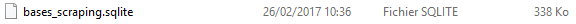
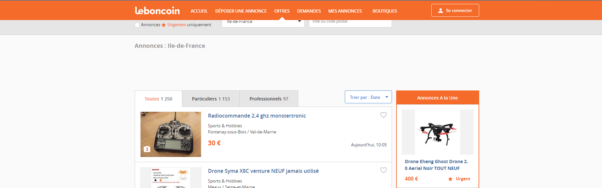
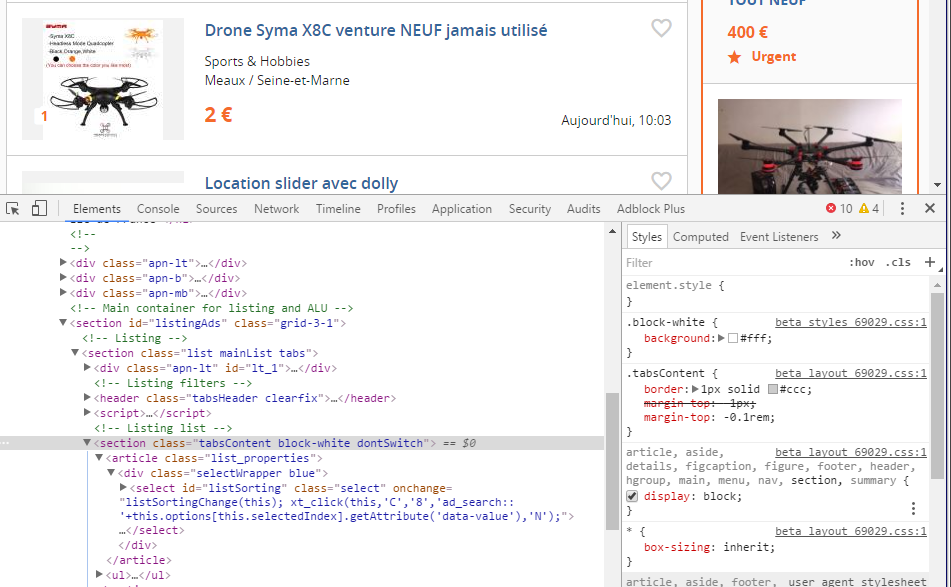
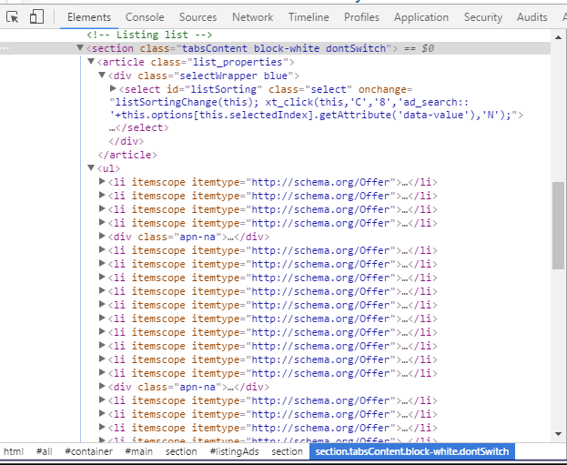

```python
from IPython.display import Image
```

# Les bases du Scraping

Le scraping ou web scraping est une technique très utilisées pour récupérer des informations non-structurées sur des sites web. Il est très efficace puisqu'il permet très facilement de récupérer n'importe qu'elles données présentes sur les pages web. Cependant il demande un gros travail d'annalyse de la page web et n'est pas scalable (ce qui implique que le travail doit être réitéré à chaque site). 

Le scraping est à différencié du crawling qui permet d'aspirer tout le texte présent sur un site en effectuant une plongée dans tous les liens qu'il découvre. Le crawler récupère le texte de chaque page mais aussi tous les liens ce qui lui permet de parcourir le site avec un certaine profondeur. Il permet de récupérer texte, contacts, mots clés etc.

Dans les deux cas, des bases du langages HTML, CSS est fortement conseillé.

## Les libraries utilisées 

Pour cela j'utilise plusieurs libraries python, qui sont des librairies de bases, requests qui permet de faire des requêtes http à un niveau assez avancé, BeautifulSoup qui permet de parser les pages retournées et requests_cache qui permet de mettre en cache toutes les pages récupérées. Cela permet d'accélerer grandement les vitesses d'éxecution , très utile en phase de test.  Et enfin pandas, pour structurer les données sous forme de tableaux. 


```python
import requests
from bs4 import BeautifulSoup
import requests_cache
import pandas as pd
requests_cache.install_cache("bases_scraping", expire_after=10e5)
```



Il faut faire très attention avec le cache, il peut être source d'erreurs et peut prendre énormément de place lorsque l'ont scrap un grand nombre de pages. Il peut atteindre très facilement plusieurs centaines de Go. Le fait d'installer un cache permet de créer une base sqlite en local, avec les pages matcher sur les urls. Lorsque l'on refait la même requête il ira chercher directement dans la base locale. 

## Récupérer une pages

Etant fan de drônes je propose de scraper la page de leboncoin proposant des offres de drônes en Ile de France.


```python
url = "https://www.leboncoin.fr/annonces/offres/ile_de_france/?th=1&q=drone"
```

Il faut souvent bien comprendre comment le site est construit. L'annlyse de l'url permet d'avoir un bon appercu de comment les requêtes sont générées et comment le modifier pour récupérer toutes les informations dont on a besoin. Par exemple, l'url de la 10e page est https://www.leboncoin.fr/annonces/offres/ile_de_france/?o=10&q=drone. Si l'on joue sur la partie de la requête /?o=N&q=notre recherche" on peut arriver a scaler notre scraping.  

Dans un premier temps on va récupérer la première page. La récupération des autres pages se fera exactement de la même façon. 


```python
response = requests.get(url)
response
```


    <Response [200]>


En checkant, le code de la response renvoyée on peut directement savoir si notre requête est passée ou pas. Plusieurs codes http sont à savoir : 
- 200 : Ok
- 403 : Forbidden
- 203 : No content 
- 404 : Error

Dans la plupart des cas, les sites n'aiment pas trop recevoir des requêtes de scripts python et renvoient souvent des pages vides ou des erreurs. Pour remédier à cela il faut utiliser un User-Agent qui permet de se faire passer pour un navigateur de son choix.


```python
headers = {'User-Agent': 'Mozilla/5.0 (Macintosh; Intel Mac OS X 10_10_1) AppleWebKit/537.36 (KHTML, like Gecko) Chrome/39.0.2171.95 Safari/537.36'}

response = requests.get(url, headers=headers)
```

Dans notre cas, on fake l'utilisation d'un navigateur mozilla depuis un MAC OSX. 


```python
response.text[0:2000]
```


    '\n<!DOCTYPE html>\n\n<html class="no-js">\n    <head>\n        <!--\n            / \\    We\'re hiring. Now.\n           /   \\\n          /     \\  Want to code using Go, Python, C, SQL, PHP, JS, Java,\n         |\\     /| and play with Casssandra, Kafka, Thrift or Redis?\n         | \\   / | If you enjoy tackling unique and challenging scalability\n         |  \\ /  | problems, just know we have many IT positions available.\n         |   |   | Wether you are just out of school or a seasoned tech\n          \\  |  /  veteran, just take a look at our current job offers:\n           \\ | /\n            \\ /    https://corporate.leboncoin.fr/nos-offres/\n        -->\n        <!--[if lt IE 9]>\n            <script>\n                document.createElement("header");\n                document.createElement("nav");\n            </script>\n        <![endif]-->\n    \t\n\n        \n        \n            \n\n            \n                \n                    \n\n                \n            \n\n            \n\n            \n\n            <link rel="alternate" href="android-app://fr.leboncoin/http///www.leboncoin.fr/annonces/offres/ile_de_france/" />\n        \n\n        <link rel="icon" type="image/png" href="//static.leboncoin.fr/img/favicon-beta.png" sizes="16x16">\n        <link rel="icon" type="image/png" href="//static.leboncoin.fr/img/favicon-beta-32.png" sizes="32x32">\n        <link rel="apple-touch-icon" type="image/png" href="//static.leboncoin.fr/img/favicon-beta-touch.png">\n        \n        <link rel="stylesheet" type="text/css" href="//static.leboncoin.fr/css/beta_layout_69029.css">\n        <link rel="stylesheet" type="text/css" href="//static.leboncoin.fr/css/beta_styles_69029.css">\n        \n\n        <script type="text/javascript" src="//static.leboncoin.fr/js/mobile-detect.min.js"></script>\n\n         \n        <script type="text/javascript" src="//www.leboncoin.fr/templates/common/arrays.js?69029"></script>\n        <script type="text/javascript" src="//static.leboncoin.fr/js/beta_base_69029.js"></script>\n    \n    '


response.status_code

Tout le contenu de la page est retourné. Que ce soit les scripts JS, mais aussi le contenu html. C'est dans le contenu HTML que nous allons rechercher les informations. Pour cela on utilise BeautifulSoup qui permet de parser assez facilement du contenu HTML avec un syntaxe assez simple. 


```python
soup = BeautifulSoup(response.text, "lxml")
```

On peut pour vérifier, récupérer le text de la page...


```python
soup.h1.text.replace("\n", "")
```


    'Annonces : Ile-de-France '




Si on veut maintenant récupérer toutes les annonces avec leur prix il faut se pencher plus en détails sur la structure HTML de la page. Pour cela on peut ouvrir l'inspecteur du navigateur (Chrome de préférence) avec F12 ou Ctrl + Maj + I. Qui permet de naviguer dans le HTML très facilement. 

Pour récupérer les informations il va falloir retrouver les balises qui contiennent les données. Pour cela il est important de partir des balises les plus englobantes (balises parentes) jusqu'au balises filles que l'on veut. Pour cela, il faut récupérer le nom des identifiants de ces dernières. On sait qu'il existe de nombreux types d'identifiants (id, class, etc.). Seulement les seuls identifiants uniques sont les id. Les class peuvent être nombreuses. Si vous devez privilégié un identifiant préférez les ids. 



Ici on voit que la list des annonces est comprise dans la section id="listingAds" et ensuite dans la class="tabsContent. Pour récupérer cette div fille c'est très facile l'objet soup créé possède des méthodes permettant de parser facilement la page.


```python
div_fille = soup.find(id="listingAds").find(class_="tabsContent")
str(div_fille)[0:1000]
```


    '<section class="tabsContent block-white dontSwitch">\n<ul>\n<li itemscope="" itemtype="http://schema.org/Offer">\n<a class="list_item clearfix trackable" data-info=\'{"event_type" : "selfpromotion", "campaign" : "ad_search", "ad_listid" : "1098677680", "ad_location" : "list_content", "ad_position" : "1", "ad_type" : "offres", "ad_offres" : "part"}\' href="//www.leboncoin.fr/sports_hobbies/1098677680.htm?ca=12_s" title="Radiocommande 2.4 ghz monstertronic">\n<!-- Listing item image -->\n<div class="item_image">\n<span class="item_imagePic">\n<span class="lazyload" data-imgalt="Radiocommande 2.4 ghz monstertronic" data-imgsrc="//img0.leboncoin.fr/ad-thumb/845c8abbc5f7f22c9babb8f1e581174245a26657.jpg" style="display:block; width:100%; height:100%;"></span>\n</span>\n<span class="item_imageNumber">\n<i class="icon-camera icon-2x nomargin"></i>\n<span>3</span>\n</span>\n</div>\n<!-- Save ad (Mes annonces) -->\n<div class="saveAd" data-savead-id="1098677680" title="">\n<div class="saveMsg"><i class="showTip m'


Les balises ul et li permettent de créer des listes. On peut alors récupérer toutes les annonces comme ceci...




```python
all_ads = div_fille.find("ul").findAll("li")
print(len(all_ads))
```

    35
    

Les pages sont constituées de 35 annonces. Il suffit de boucler sur chaque objet et de récupérer ce que l'on veut de la même manière que précédement. Comme je travail beaucoup avec des dataframe Pandas je stock mes informations sous la forme de liste de dictionnaires python pour pouvoir les intégréer directement mais on peut les stocker de n'importe quelle façon.


```python
list_all_ads = []
for ads in all_ads:
    infos = ads.find(class_="item_infos")
    title = infos.find(class_="item_title").text.strip()
    try:
        price = infos.find(class_="item_price").text.strip()
    except:
        price = None
    list_all_ads.append({"title":title, "price":price})
```

On peut maintenant regarder le résultat dans une dataframe pandas.


```python
df_leboncoin = pd.DataFrame(list_all_ads)
df_leboncoin.head()
```


<div>
<table border="1" class="dataframe">
  <thead>
    <tr style="text-align: right;">
      <th></th>
      <th>price</th>
      <th>title</th>
    </tr>
  </thead>
  <tbody>
    <tr>
      <th>0</th>
      <td>30 €</td>
      <td>Radiocommande 2.4 ghz monstertronic</td>
    </tr>
    <tr>
      <th>1</th>
      <td>2 €</td>
      <td>Drone Syma X8C venture NEUF jamais utilisé</td>
    </tr>
    <tr>
      <th>2</th>
      <td>15 €</td>
      <td>Location slider avec dolly</td>
    </tr>
    <tr>
      <th>3</th>
      <td>530 €</td>
      <td>DJI Phantom 3 neuf + nbreux accessoires</td>
    </tr>
    <tr>
      <th>4</th>
      <td>30 €</td>
      <td>Drone 17 cm 4 modes déplacement Neuf sous Blister</td>
    </tr>
  </tbody>
</table>
</div>


